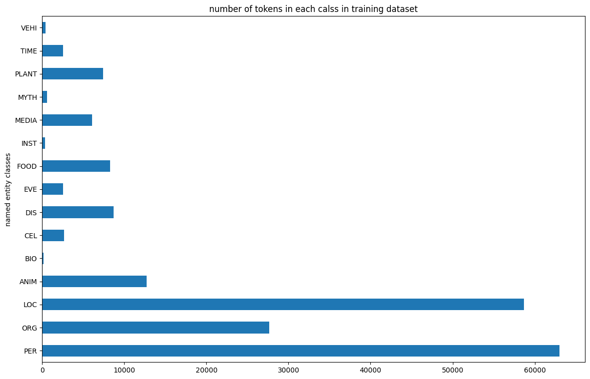
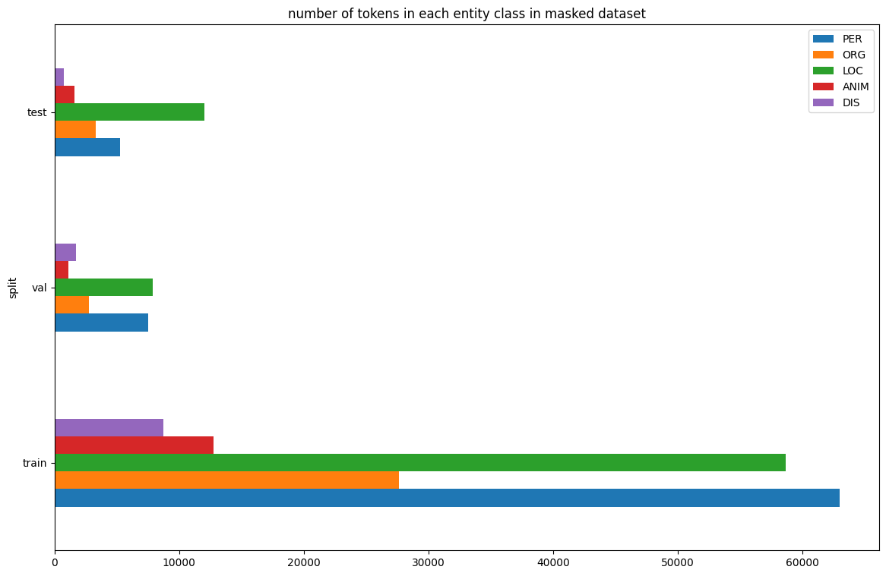

# ner
## NER task on MultiNERD dataset

This repository contains codes for fine-tuning a pre-trained large language model on MultiNERD dataset for NER task. The goal of this implementation is detecting the effect of removing (mask) some of the named entity classes from the dataset (set them to non named entity) on the performance of the model on the other entities. The selected classes to be kept in both experiments are:
1. PER
2. ORG
3. LOC
4. DIS
5. ANIM

## run instructions:
Before running the codes, install requirements from requirements.txt file.
* training
    1. set training arguments in arguments.py file. You can choose a pre-trained checkpoint from HuggingFace hub there. 
    2. run train.py 

* inference
    1. set the inference arguments in arguments.py file. 
    2. run inference.py

## evaluation metrics:
Analyzing the dataset shows that the classes are significantly imbalanced and accuracy metric would't be insightful. So, the combination of the metrics that are chose to evaluate the models are:
1. accuracy
2. precision
3. F1 score
4. recall
These metrics are evaluated on each of the selected categories.

## results:
Due to limited computational resources, 2 light weight models are chose to be fine-tuned. Although being lightweight, their results are comparable to the larger models like BERT. You can find the trained checkpoints in [this](https://huggingface.co/pariakashani) HuggingFace repository. Performance of the fine-tuned models is measured on the test dataset.
1. DistilBERT
    * default dataset:
        - without augmenting:
        - with up-sampling
    * masked dataset:
2. roBERTa
    * default dataset

## highlights:
1. class imbalance specially in 'DIS' and 'ANIM' categories had resulted in significantly lower results on these classes. As a solution for this problem, a very simplified version of up-sampling was examined by repeating each sentence with these classes in it, 2 times in the training dataset, but no improvement was observed.
2. although a light-weight model is used in this task, except above mentioned classed, performance on the other classes was acceptable and making the model larger doesn't seem to be helpful in improving the results.
3. adding examples from other english language NER datasets that are larger may improve the performance.

## Acknowledge:
most of the codes in this repository are taken from HuggingFace [tutorial on Token Classification](https://huggingface.co/docs/transformers/tasks/token_classification) and are modified for this task's dataset.

